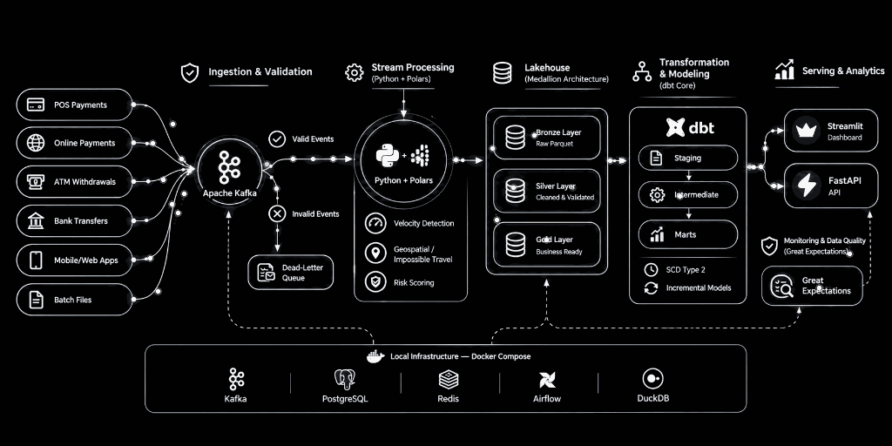

<div align="center">

# AuditTrace

**A local-first financial transaction lakehouse with automated fraud surveillance, Medallion storage, and dimensional modeling.**

<br />



<br />

[](https://www.python.org/)
[](https://duckdb.org/)
[](https://pola.rs/)
[](https://getdbt.com/)
[](LICENSE)

</div>

---

## Overview

In electronic payment systems, incoming transaction streams require strict auditability, schema enforcement at the perimeter, and immediate risk screening before reaching analytical downstream consumers.

**AuditTrace** is an end-to-end financial data pipeline that manages the entire lifecycle of payment events:

- **Synthetic Event Generator**: Generates realistic ISO-8583 banking transactions across multiple currencies (`USD`, `EUR`, `GBP`, `EGP`, `SAR`, `AED`), merchant categories, and deterministic fraud attack vectors.
- **Contract Enforcement & Dead-Letter Queue (DLQ)**: Validates incoming event payloads against strict data contracts; invalid records (negative amounts, out-of-bounds geographic coordinates, missing identifiers) are isolated to `invalid_records.jsonl` without dropping or halting the stream.
- **Medallion Lakehouse Architecture**:
  - **Bronze**: Append-only, immutable Parquet files partitioned by date (`year=YYYY/month=MM/`).
  - **Silver**: Deduplicated, cleaned, and currency-normalized DuckDB tables with real-time anomaly scoring.
  - **Gold**: Business-ready Star Schema (`fact_transactions`, `dim_customers`, `dim_merchants`, `dim_dates`, `dim_locations`, `agg_daily_fraud_summary`).
- **Surveillance & Operations UI**: An interactive Streamlit console providing real-time risk inspection, Lakehouse SQL querying, and DLQ diagnostics.

---

## Key Engineering Decisions

### 1. In-Process Analytical Engine (DuckDB + Polars)
Rather than introducing distributed cluster overhead (JVM initialization, memory serialization, executor connection drops) for single-node development:
- **DuckDB** provides zero-dependency, vectorized columnar SQL execution with full ACID compliance.
- **Polars** provides multi-threaded, zero-copy Arrow memory operations for batch ingestion.
- The pipeline executes locally with zero cloud costs while mirroring production Lakehouse patterns.

### 2. Defensive Ingestion via Dead-Letter Queue (DLQ)
Financial pipelines cannot simply drop bad records or crash when an unexpected schema payload arrives. AuditTrace evaluates contract rules prior to Bronze ingestion:
- Valid payloads proceed through the ingestion pipeline.
- Corrupted or non-conforming payloads are routed to `data/lakehouse/dlq/invalid_records.jsonl` along with rejection timestamps and root-cause reasons.

### 3. Deterministic Fraud Detection Rules
Instead of un-auditable black-box machine learning models, fraud detection is governed by deterministic business rules:
- **Velocity Burst Detection**: Monitors transaction frequency and rolling spend volume within a 5-minute sliding window per card.
- **Impossible Travel (Haversine Formula)**: Computes the great-circle geographic distance between consecutive card authorizations for the same customer. Speeds exceeding commercial airline thresholds (>850 km/h) trigger an immediate `IMPOSSIBLE_TRAVEL` flag.
- **High-Risk MCC & Off-Hours**: Screens merchant category codes (e.g., crypto exchanges, gambling platforms) during off-peak hours (02:00–05:00 UTC).

---

## Measured Hardware Benchmarks

The figures below represent actual, unthrottled execution runs on a local development machine using the included benchmark suite (`scripts/benchmark.py`).

- **Operating System**: Windows 10 (64-bit)
- **Processor**: AMD Ryzen (16 Logical Cores)
- **RAM**: 16 GB DDR4
- **Runtime**: Python 3.11.9

| Batch Size | Execution Time | Throughput | Bronze Parquet Storage |
| :--- | :--- | :--- | :--- |
| **1,000 transactions** | **0.83 sec** | **1,210 events/sec** | 423.4 KB |
| **5,000 transactions** | **1.65 sec** | **3,026 events/sec** | 912.5 KB |
| **10,000 transactions** | **3.12 sec** | **3,205 events/sec** | 1,820.0 KB |

*To reproduce these numbers on your machine, run `python scripts/benchmark.py`.*

---

## Project Structure

```text
audittrace-lakehouse/
├── config/
│   ├── settings.py                # Environment-driven Pydantic configuration
│   └── logging_config.py          # Structured JSON & console logging
├── stream_producer/
│   ├── schemas.py                 # ISO-8583 payment transaction contracts
│   └── synthetic_generator.py     # Deterministic transaction generator
├── stream_processor/
│   ├── fraud_detector.py          # Haversine distance & velocity algorithms
│   ├── enricher.py                # Customer & merchant dimension enricher
│   └── processor.py               # Stream & micro-batch processor
├── lakehouse/
│   └── star_schema.py             # Gold Layer dimensional model builder
├── dashboard/
│   └── app.py                     # Streamlit operations & SQL dashboard
├── scripts/
│   ├── benchmark.py               # Hardware benchmarking script
│   └── render_perfect_animation.py # Infographic animation renderer
├── tests/
│   ├── test_fraud_detector.py     # Unit tests for geospatial & velocity logic
│   └── test_pipeline_e2e.py       # End-to-end integration test suite
├── docker/
│   └── docker-compose.yml         # Optional containerized stack (Kafka, Postgres)
├── run_pipeline.py                # Single-command pipeline runner
├── requirements.txt               # Pinned dependencies
├── LICENSE                        # MIT License
└── README.md
```

---

## Quick Start

### 1. Clone the repository
```bash
git clone https://github.com/ahmedamr022/audittrace-lakehouse.git
cd audittrace-lakehouse
```

### 2. Set up virtual environment
```bash
python -m venv .venv

# Windows:
.\.venv\Scripts\activate

# Linux / macOS:
source .venv/bin/activate

pip install -r requirements.txt
```

### 3. Run the complete pipeline
Execute a batch of 2,500 transactions (generates synthetic payments, runs quality validation gates, isolates DLQ payloads, updates Bronze Parquet, populates Silver DuckDB, and materializes Gold Star Schema):
```bash
python run_pipeline.py --events 2500
```

### 4. Execute test suite
```bash
python -m pytest -v
```

### 5. Launch the Operations Dashboard
```bash
streamlit run dashboard/app.py
```
Access the interface at `http://localhost:8501` to view live transaction velocity metrics, examine flagged fraud payloads, inspect the Dead-Letter Queue, and execute direct SQL queries on the analytical database.

---

## Dimensional Data Model

The Gold Layer implements a Kimball-style dimensional model inside DuckDB:

- **`fact_transactions`**: Grain represents one financial transaction. Measures include `amount_local`, `amount_usd`, `risk_score`, and foreign keys referencing all dimensions.
- **`dim_customers`**: Customer profile, card tier, home jurisdiction, and activity timestamps.
- **`dim_merchants`**: Merchant name, category code (MCC), and categorized business risk tier.
- **`dim_dates`**: Calendar dimension containing year, month, day, day of week, and weekend flags.
- **`dim_locations`**: Geographic center coordinates, city, and country attributes.
- **`agg_daily_fraud_summary`**: Daily rollups of transaction volume, fraud rate percentage, and anomaly breakdowns.

---

## Technical Discussion & Interview Context

- **Idempotency & Deduplication**: Transactions are deduplicated on `transaction_id` during the Silver layer upsert, guaranteeing exact-once processing semantics downstream.
- **Perimeter Contract Defense**: The Dead-Letter Queue prevents malformed payloads from breaking downstream transforms while retaining an audit trail for forensic investigation.
- **Columnar Storage Optimization**: Snappy-compressed Parquet in the Bronze layer provides high compression ratios while retaining metadata for predicate pushdown and column pruning.
- **Geospatial Kinematics**: Great-circle distance calculations via the Haversine formula allow evaluating transit feasibility between card authorization events.

---

## License

This project is licensed under the MIT License. See [LICENSE](LICENSE) for details.
